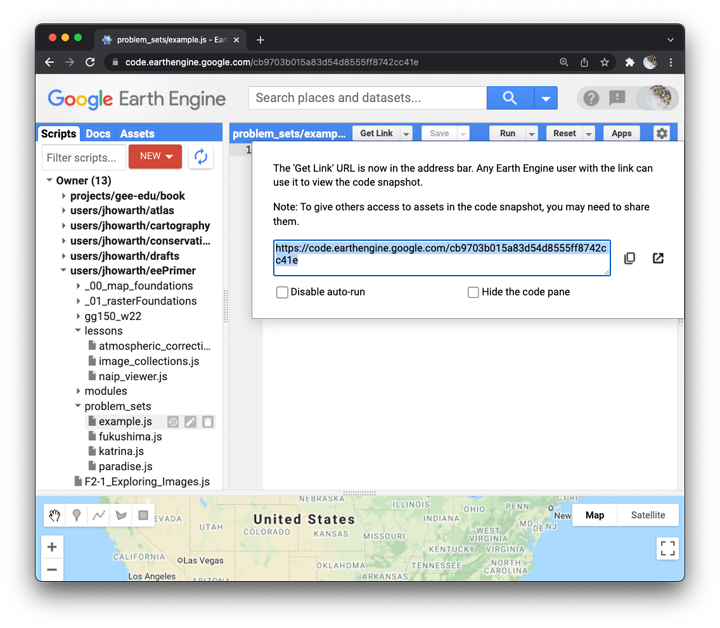

## Independent problem   

_Geography/Environmental Studies 150_   

### Honor Code Pledge  

“I have neither given nor received unauthorized aid on this assignment.”  

_Please note that by signing this honor code, you pledge to follow the authorizations described below. You also pledge to **not** distribute or share any part of this repository, or any part of the scripts that you develop while solving these problems, with other students outside of the present class at any time, so that I can re-use these problems in the future without disadvantaging students in the present. Thank you._

### Get organized    

Please get organized.

Create a new folder in your earth engine GG150 repository called **IP**, or something roughly equivalent.  

For each problem, you must create a separate script in this folder. In other words, over the two-day IP you will write **three separate javaScript files**, one for each problem solution. Tuesday you receive one problem; Wednesday you receive two more.

Please **save your work regularly**. EE uses git, so saving is a commit, which facilitates versioning, which is a helpful way of documenting workflows.    

When you are ready to submit your solutions, you will copy and paste url links for each script into a google form. The next section describes how that works.  

### Dropbox

Please open this [**DROPBOX**](https://forms.gle/kxTYu5433coD4J7v6).  

In the appropriate places, please write your email address, the honor code, and your name. When you have finished a problem, please **copy and paste a url to the script** in the form for the problem.  

Please note: the form contains places to paste a link to all three problems. On Tue, please submit the form with the solution for Problem 1 and leave the answers for Problems 2 and 3 blank. On Wed, please submit the form with solutions for Problem 2 and 3 and leave the answers for Problem 1 blank.      

### How to generate a link to your script

You should be familiar with this routine by now from our practice problems. When you have finished a problem:  

1. Save the script.
2. Then click the **Get Link** button at the top of the Code Editor panel.  

  

This will generate a url to your script. The url is shown in the pop-up panel. It is also shown in the address bar of your browser.  

Please copy the url and then paste it into the appropriate section of the form.  

Before the clock runs out please click the **Submit** button.     

You will automatically receive a copy of your submission to the email account that you provided.  

_Please note that the Get Link url creates a snapshot of your script. If you make any changes to your code after creating the url, I will not be able to see them. I only see the state of your script when you click the Get Link button. This means that you can continue to work on the script after submitting your first solutions and do not need to create new javaScript files to work on the next phase._  

### Problems  

_Links will become available during first and second phases._    

- Problem 1
- Problem 2
- Problem 3
